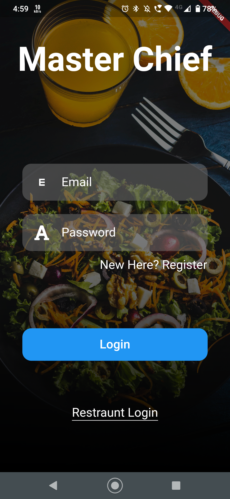
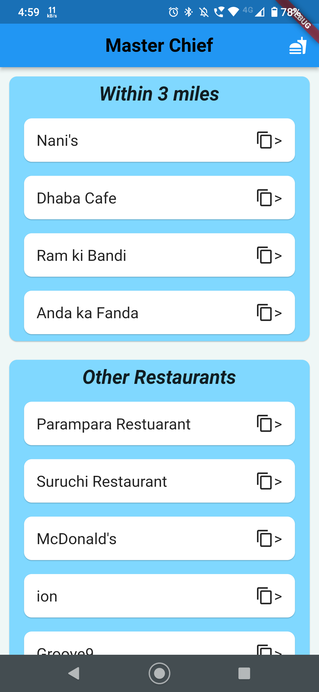
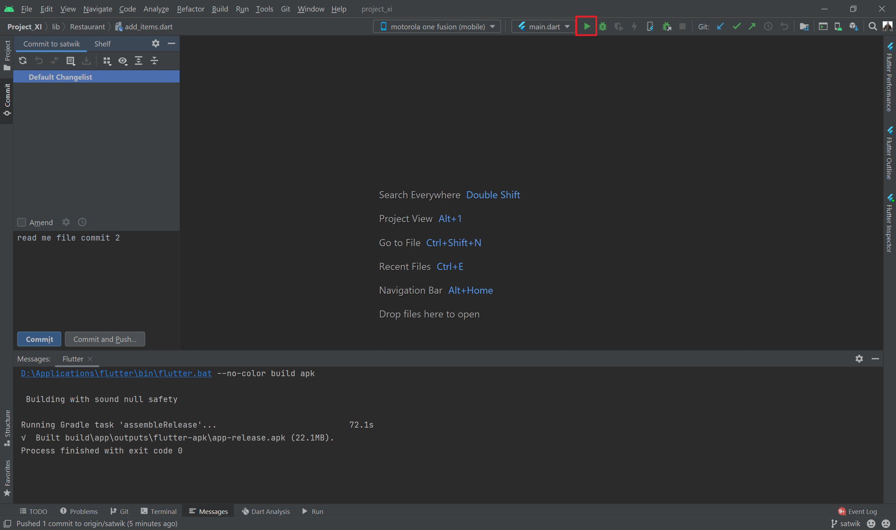

# *Master Chief*

Flutter Representation of an Online Food Delivery App

- Users will able to order the food.
- Restaurants will able to Accept the orders.
- Restaurants can also Reject the orders if there is any shortage of Food.
- User can Order the items based on the name of the Dish or he can also identify using the Picture.
- User can view the Prices of the Dishes.

## Project Installation:
1. The Project is available in [Gitlab](https://gitlab.com/).
2. Open the Project and copy the *http* link which is shown below
   
3. Go to your Android Studio > close your pre-opened projects > Open Menu > Get from Vesion Control.
   
4. Paste the *http* URL here and then click on clone.
   
   
5. Then Select device and Run the code as shown below :
   